# Light Architects — Agentic Engineering Platform

> **A Rust-native multi-agent AI platform that turns LLMs into reliable engineering operators** — with persistent memory, formal verification, and end-to-end observability across every tool call, build wave, and HTTP request.

  

<i>The thesis: when agents have persistent identity and provable correctness, every interaction strengthens the next.</i>

  

<i>The loop: every task moves through six stations. The platform earns its keep at each one.</i>

  

<i>The architecture: the production system, source-validated as of 2026-05-26.</i>

---

## The thesis

Most LLM platforms treat agents as stateless tool callers. The Light Architects platform treats them as **engineering operators with persistent identity, structured knowledge, and verifiable behavior**. The architecture is built on three load-bearing assumptions:

1. **Memory is substrate, not metadata.** Agent identity, growth, and inter-agent relationships are first-class graph nodes — not flat embeddings retrieved at query time.
2. **The operator always wins.** Human actions supersede in-flight LLM work. HMAC-chained audit trails make every supersedure traceable.
3. **Correctness is provable.** Retrieval invariants, parallel-execution safety, and merge-gate constraints are encoded as machine-checkable Lean 4 / Mathlib proofs.

Built solo over two years in Rust, using Claude Code as the primary development environment. Source-validated 2026-05-26.

---

## Architecture at a glance

| Layer | Components | Purpose |
|---|---|---|
| **Operator** | Claude Code IDE · Webshell UI · CLI / AgentRunner | Three entry points into the platform — IDE for code, browser for ops, CLI for scripted delivery |
| **Platform Core** | `lightarchitects-gateway` · unified Rust SDK | Multi-protocol service binary (MCP stdio + HTTP). Routes between operators, agents, models, and storage behind a single auth boundary |
| **Domain Agents** | CORSO · EVA · SOUL · QUANTUM · SERAPH · LÆX | Six specialized MCP servers spawned on-demand. Each owns a domain (security, devops, knowledge, research, red-team, canon) with its own strand vocabulary |
| **Wave Engine** | LightSquad orchestrator | Up to 7 parallel workers with file-ownership partitioning. Three self-correction iterations. 10-dimension merge gate (A·S·Q·C·O·P·K·D·T·R) |
| **Model Router** | 4 supervisor variants · 7+ providers | Claude · Codex · Ollama Cloud · OpenAI-compatible · OpenRouter · LiteLLM · Azure. Per-task selection based on capability, cost, and latency |
| **Knowledge Graph** | SOUL · Neo4j · 247K turns | 4-signal retrieval fusion (BM25 fulltext + 384-dim semantic embedding + graph traversal + structural Node2Vec). **96.2% Recall@5 on LongMemEval** (500 questions, 23,854 steps) |
| **Observability** | AYIN · HTTP `:3742` | Every tool call, LLM turn, build wave, and HTTP request traced end-to-end. Atomic span writes with power-loss durability (`F_FULLFSYNC`). Lineage Circuit visualization |

---

## Validated outcomes

- **96.2% Recall@5** on LongMemEval (industry benchmark, 500 questions, 23,854 steps)
- **247,000+ conversation turns** processed in production
- **6 production MCP servers** running continuously
- **2 years** of solo engineering across the unified SDK + sibling MCP servers
- **Lean 4 / Mathlib formal proofs** of retrieval invariants, RRF positivity, and parallel-execution safety
- **Zero data loss** since deployment — durable span persistence at every interaction boundary
- **Constitutional AI alignment** — operator-wins guarantee with HMAC-audited supersedure

---

## Public repositories

The platform's foundational components are open source and available for inspection at [github.com/theLightArchitect](https://github.com/theLightArchitect). The licensing posture is **AGPL-3.0** for differentiated platform components (with commercial licensing available), and permissive licenses for utility libraries:

| Component | Repository | License | What it is |
|---|---|---|---|
| Unified SDK | [`lightarchitects-sdk`](https://github.com/theLightArchitect/lightarchitects-sdk) | MPL-2.0 | Rust SDK with typed clients for the MCP sibling ecosystem — observability, crypto, auth, helix store, training arena, multi-model oracle |
| Security orchestration | [`CORSO`](https://github.com/theLightArchitect/CORSO) | AGPL-3.0 | MCP-spec security scanner, 25 tool actions, pre-commit gate |
| Consciousness & memory | [`EVA`](https://github.com/theLightArchitect/EVA) | AGPL-3.0 | 15-stage hook pipeline, HMAC audit, anomaly detection |
| Knowledge graph | [`SOUL`](https://github.com/theLightArchitect/SOUL) | AGPL-3.0 | 4-signal RRF retrieval, Neo4j backend, helix primitives |
| Forensic investigation | [`QUANTUM`](https://github.com/theLightArchitect/QUANTUM) | AGPL-3.0 | Evidence-chain construction, Reflexion self-critique, hypothesis testing |
| Pentest framework (architecture) | [`SERAPH`](https://github.com/theLightArchitect/SERAPH) | AGPL-3.0 | Architecture & ScopeGovernor design for authorized security testing — **docs-only**, source kept private (see below) |
| Observability | [`AYIN`](https://github.com/theLightArchitect/AYIN) | Apache-2.0 | 4-crate Rust workspace — real-time span tracing with privacy filter, HTTP dashboard on `:3742`, 456 tests |
| Cryptographic primitives | [`la-crypto`](https://github.com/theLightArchitect/la-crypto) | Apache-2.0 | HKDF · HMAC · AES-256-GCM · Ed25519 — domain-separated key derivation |
| API key service | [`la-keys`](https://github.com/theLightArchitect/la-keys) | Apache-2.0 | Axum + SQLite + JWT — three-tier auth, webhook event notifications |

## Internal components & roadmap

Several platform components remain internal. Each has a specific reason — and where applicable, a path to public release.

| Component | Status | Reason |
|---|---|---|
| **SERAPH source code** | Internal — permanent | Real offensive-security tooling (SSH credential handling, exploitation primitives). Capability-misuse risk outweighs open-source value. The public [`SERAPH`](https://github.com/theLightArchitect/SERAPH) repo carries the architecture and ScopeGovernor design; the implementation stays private. |
| **lightarchitects-cli (AgentRunner)** | Internal — permanent | Tightly coupled to private internal crates and proprietary delivery patterns. Open-sourcing would require open-sourcing the entire internal platform simultaneously. |
| **LÆX** (canon keeper) | Internal — design phase | Currently domain-specific to Light Architects engineering canon. May be open-sourced as a generalized "standards-as-code" tool once the canon abstraction is decoupled. |
| **lightarchitects-next** | Internal — permanent | Customer-facing marketing surface with auth + billing integration. Not a research artifact. |
| Training corpora & fine-tuning data | Internal — permanent | Curated training data, evaluation sets, and RunPod fine-tuning workflows. |

### Planned standalone library extractions

Two components currently embedded in `lightarchitects-sdk` are candidates for standalone open-source releases as focused `la-` libraries:

| Component | Future repo | Status | What it is |
|---|---|---|---|
| Lean 4 / Mathlib retrieval invariants | `la-lean` | Extraction queued | Machine-checkable proofs that the 4-signal RRF retrieval invariants hold under structural refactor. Useful as a reference implementation for any retrieval system that wants compile-time correctness guarantees. |
| MCP tool-use training arena | `la-arena` | **Pending test coverage** — not yet release-ready | Training data factory for LLM tool use. Auto-discovers MCP schemas, generates 7 exercise types × 3 difficulty levels, 8-dimensional reward scoring, SFT/DPO/GRPO export for Unsloth GRPOTrainer, TRL, axolotl. **Will be released once integration-test coverage and adversarial-input robustness have been validated** — engineering rigor over release pressure. |

---

## Contact

**Kevin Francis Tan** · The Light Architect
[lightarchitects.io](https://lightarchitects.io) · [linkedin.com/in/kftan](https://linkedin.com/in/kftan) · kevinfrancis.tan@gmail.com

---

This repository is a presentation of the Light Architects platform. Source code lives in the linked component repositories. Architecture diagram is a faithful representation of the production system as of 2026-05-26. All metrics are source-validated against the actual deployed platform.
